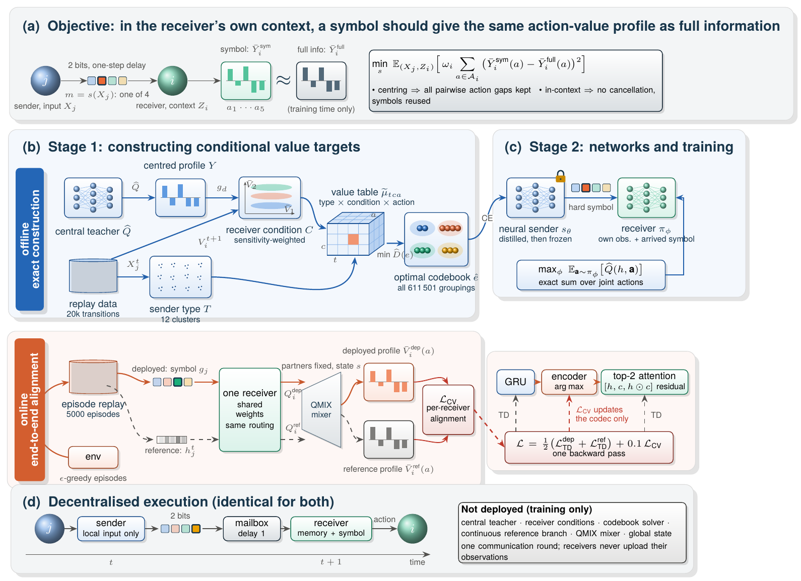
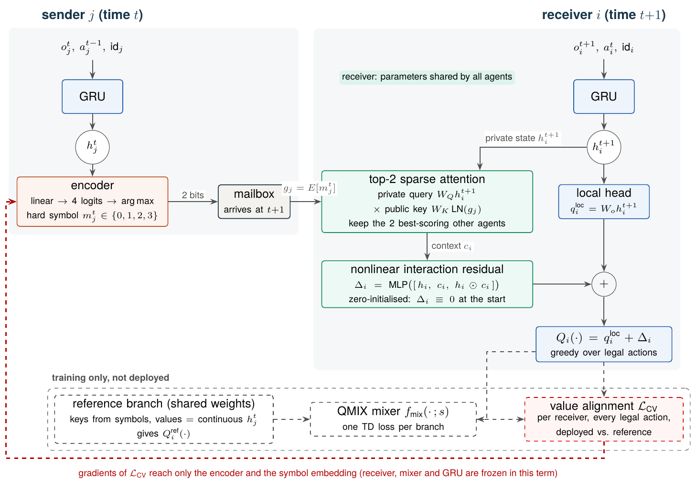
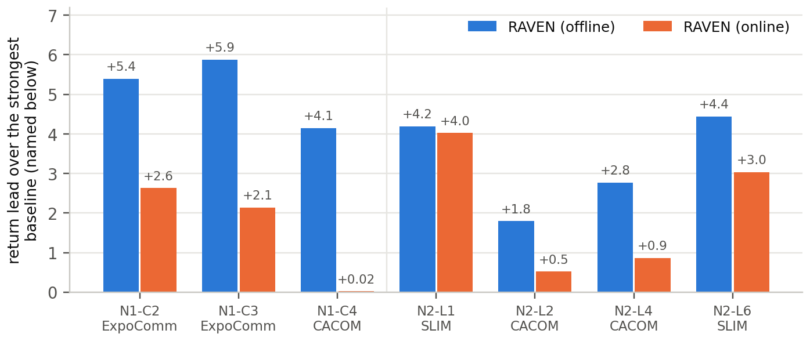
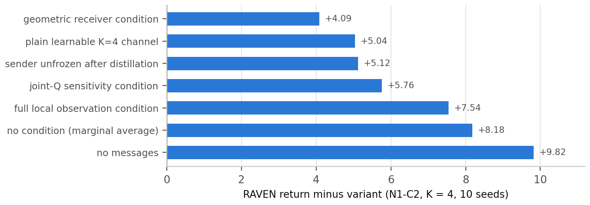

<div align="center">

# RAVEN

### Receiver-conditioned Action-Value ENcoding for Finite-Symbol Multi-Agent Communication

[](LICENSE)
[](pyproject.toml)
[](https://pytorch.org)
[](#citation)

[Shuwei Sun](https://github.com/sswun) &nbsp;·&nbsp; [ORCID 0009-0009-4809-8557](https://orcid.org/0009-0009-4809-8557)

**2 bits per message &nbsp;·&nbsp; one communication round &nbsp;·&nbsp; symbols chosen for what the receiver has to decide**

</div>

<p align="center">
  
</p>

RAVEN is a communication method for cooperative multi-agent reinforcement learning under a hard bandwidth limit.
Each message is one of **K = 4 symbols** (2 bits) and arrives **one step later**. Instead of asking a symbol to
reconstruct what the sender saw, RAVEN asks it to preserve what the *receiver* needs: the differences between the
values of the receiver's own actions, evaluated **inside the receiver's own situation**.

This repository contains the reference implementation of both ways we solve the RAVEN objective:

* an **offline implementation** (exact construction) for tasks where a centralised teacher can be trained and
  the joint action space can be enumerated, and
* an **online implementation** (end-to-end alignment) that plugs into a QMIX learner and scales to StarCraft II
  teams of ten agents.

### Highlights

- **Navigation.** Ahead of SLIM, NDQ, CACOM and ExpoComm on two-agent navigation, 3- and 4-agent rings and
  one-to-many broadcast; on N1-C2 better than all five external methods on 5/5 seeds each.
- **Mechanism.** Removing the receiver's situation from the target loses 83% of the communication gain (10 seeds).
- **Scale.** 87.4% win rate on the super-hard SMAC map MMM2 with 10 agents (QMIX 57.8%, best listed baseline 66.5%).
- **Communication pays.** +42.8 percentage points capture success over a same-backbone QMIX without messages.
- **Cost.** 2 bits per message; 5,257 deployed parameters on speaker–listener (SLIM: 264,005).

---

## Contents

- [The idea in one paragraph](#the-idea-in-one-paragraph)
- [Method](#method)
- [Results](#results)
- [Installation](#installation)
- [Quick start](#quick-start)
- [Reproducing the experiments](#reproducing-the-experiments)
- [Repository layout](#repository-layout)
- [Citation](#citation)
- [License](#license)

## The idea in one paragraph

With only four symbols, a sender can distinguish four "kinds" of situations at most, so the question is *which*
distinctions to keep. Existing learned channels either reconstruct the sender's observation or push task gradients
through a discrete bottleneck. The first spends bits on details no receiver acts upon; the second is noisy and,
more importantly, averages over the receiver's situations: the same piece of news can make action A better for a
receiver in one situation and action B better in another, and averaged over situations the two effects cancel.
RAVEN compares the receiver's action values *within* each receiver situation, so the effects never cancel and a
symbol can be reused across situations in which it means different things.

## Method

### Objective

For a directed edge from sender $j$ to receiver $i$, let $\bar Y_i^{\text{full}}(a)$ be the receiver's centred
action-value profile when the sender's full information is available and $\bar Y_i^{\text{sym}}(a)$ the profile
given only the symbol $m = s(X_j)$. RAVEN chooses the sender $s$ by

$$
\min_{s}\;\mathbb{E}_{(X_j, Z_i)}\Big[\,\omega_i \sum_{a \in \mathcal{A}_i}
\big(\bar Y_i^{\text{sym}}(a) - \bar Y_i^{\text{full}}(a)\big)^2\Big],
$$

where the expectation runs jointly over the sender's input $X_j$ and the receiver's own context $Z_i$.
Centring over legal actions preserves every pairwise action gap, and comparing profiles inside the receiver's
context is what prevents the cancellation described above. The receiver's context is used to *organise training
targets only*: it is never transmitted, and at execution time each agent acts on its own observation, its own
memory and the symbols that arrived.

### Two implementations of the same objective

| | **Offline: exact construction** | **Online: end-to-end alignment** |
|---|---|---|
| Use when | a centralised teacher can be trained and joint actions can be enumerated | large teams, long horizons, no teacher |
| Stage 1: targets | Double-DQN teacher $\widehat Q$ → centred receiver profiles → 12 sender types and 12 sensitivity-weighted receiver conditions → shrunk value table $\widetilde\mu_{tca}$ | a *reference branch* that shares every weight with the deployed receiver but aggregates the senders' continuous states instead of symbols |
| Stage 2: networks | exact codebook over all $S(12,4) = 611{,}501$ groupings, distilled into a sender MLP that is then frozen; receivers maximise the teacher's joint value exactly | GRU agents + QMIX; linear encoder with hard `argmax` symbols; top-2 sparse attention receiver with a zero-initialised interaction residual; loss $\tfrac12(\mathcal L_{\text{TD}}^{\text{dep}} + \mathcal L_{\text{TD}}^{\text{ref}}) + 0.1\,\mathcal L_{\text{CV}}$ |
| Deployed | sender MLP + receiver MLP | GRU + codec + receiver (about 62k parameters on SMAC MMM2) |

<details>
<summary><b>Online implementation: deployed network and training-only branch</b></summary>
<p align="center"></p>

$\mathcal L_{\text{CV}}$ compares, for every receiver and every legal action, the team value (through the frozen
QMIX mixer, with the partners' utilities held at their replayed actions) under the deployed and the reference
branch. Its gradient reaches only the encoder and the symbol embedding.
</details>

## Results

All numbers are means over independently trained seeds; each final model is evaluated on held-out episodes
(1000 per model unless stated otherwise), and we always use the fixed final checkpoint.

### Navigation: RAVEN against five recent communication methods

Team return (higher is better; returns are negative distances). N1 = reference navigation with 2 agents (C2) and
rings of 3 and 4 agents; N2 = one speaker broadcasting to 1/2/4/6 listeners. Every method uses the same legal
edges, the same one-step delay and 1.2M environment steps per model; SLIM, NDQ, CACOM and ExpoComm are run from
their authors' code.

| Setting | **RAVEN offline** | **RAVEN online** | SLIM | NDQ | CACOM | ExpoComm |
|:--|--:|--:|--:|--:|--:|--:|
| N1-C2 | **−9.59** | −12.35 | −18.81 | −21.34 | −17.25 | −14.98 |
| N1-C3 | **−11.47** | −15.21 | −18.79 | −19.98 | −17.84 | −17.35 |
| N1-C4 | **−13.74** | −17.86 | −20.02 | −20.06 | −17.89 | −17.92 |
| N2-L1 | **−7.70** | −7.86 | −11.89 | −14.19 | −12.64 | −15.42 |
| N2-L2 | **−7.86**<sup>‡</sup> | −9.13 | −12.10<sup>‡</sup> | −15.08 | −9.65 | −14.16 |
| N2-L4 | **−7.92**<sup>‡</sup> | −9.82 | −12.19<sup>‡</sup> | −20.52 | −10.68 | −13.66 |
| N2-L6 | **−7.82**<sup>‡</sup> | −9.23 | −12.26<sup>‡</sup> | −24.60 | −13.81 | −13.98 |

<sup>‡</sup> the model trained with one listener, reused without retraining (zero-shot) for more listeners.

<p align="center"></p>

* On N1-C2, RAVEN beats all five external methods (SLIM, NDQ, CACOM, ExpoComm and MACC) on **5/5 seeds each**,
  Holm-corrected $p \le 1.2\times10^{-3}$.
* On 3- and 4-agent rings, a confirmation run with **fresh seeds** gives leads of +7.32 / +6.28 over SLIM,
  5/5 seeds each, Holm-corrected $p \le 3.3\times10^{-4}$.
* A speaker trained with a single listener keeps its return (−7.70 to −7.92) when broadcast to up to six
  listeners, better than every baseline *retrained* at each size.

### Every component matters

Offline RAVEN against variants that each change exactly one factor, at equal capacity and equal numbers of
updates (N1-C2, K = 4, 10 independently trained seeds, each with its own teacher). Every difference shown is
significant after Holm correction, with all 10 seeds in the same direction.

<p align="center"></p>

* Averaging over the receiver's situation removes **83%** of the gain that communication brings (+8.18 of +9.82).
* How the receiver's situation is defined matters: geometric clusters, the full observation or joint-value
  sensitivity are 4.1–7.5 worse than receiver-action sensitivity.
* Constructing the codebook beats learning the discrete channel end to end (+5.04), and freezing the distilled
  sender beats fine-tuning it (+5.12).

### SMAC and MPE (online implementation)

Win rate (%) on SMAC and team return on MPE after 2.05M environment steps per seed, with one shared set of
hyperparameters. RAVEN: mean (± s.d.) over four training seeds; every agent broadcasts 2 bits per step and each
receiver attends to two senders.

| Method | MMM | MMM2 (super hard) | 3s5z | Spread | Tag | Crypto |
|:--|--:|--:|--:|--:|--:|--:|
| **RAVEN (ours)** | **99.95**<br><sub>±0.10</sub> | **87.35**<br><sub>±8.30</sub> | **96.75**<br><sub>±1.52</sub> | **−28.99**<br><sub>±0.68</sub> | **278.02**<br><sub>±2.94</sub> | **48.03**<br><sub>±0.04</sub> |
| QMIX | 98.60 | 57.80 | 86.40 | −43.42 | 23.39 | 0.38 |
| QMIX (large) | 96.88 | 26.91 | 94.91 | −44.17 | −46.04 | 21.69 |
| OW-QMIX | 98.00 | 38.75 | 89.60 | −51.50 | −51.09 | 8.70 |
| CW-QMIX | 96.00 | 2.25 | 80.50 | −49.39 | −22.87 | 47.21 |
| QPLEX | 30.75 | 62.00 | 96.50 | −31.57 | 235.09 | 45.44 |
| RODE | 98.00 | 14.00 | 63.00 | −60.18 | 106.90 | 7.25 |
| ROCO | 97.25 | 30.25 | 94.00 | −77.83 | 95.39 | 21.89 |
| QMIX + TeamComm | 98.00 | 64.25 | 91.00 | −43.73 | 68.56 | 48.00 |
| QMIX + TGCNet | 74.00 | 66.50 | **96.75** | −44.95 | 55.46 | 48.00 |

Baselines are selected reference runs from our earlier experiments with the same 2.05M-step budget (the last
evaluation before 2.05M steps). Their sampling, number of evaluation episodes and number of seeds differ from
RAVEN's protocol, so they serve as a scale reference rather than a paired comparison. CACOM and ExpoComm are
compared on navigation above, using their authors' full implementations.

**The gain comes from communication.** Against a QMIX learner with *exactly the same backbone* (same GRU,
optimiser, learning rate, replay, exploration schedule, budget and per-seed initialisation, with the codec,
receiver, reference branch and $\mathcal L_{\text{CV}}$ removed):

| Task | Metric | RAVEN | Same-backbone QMIX | Difference | Seeds better |
|:--|:--|--:|--:|--:|:-:|
| Predator–prey (5×5, vision 1) | capture success | **96.0%** | 53.2% | **+42.8 pp** | 5/5 |
| MPE Spread | team return | **−29.00** | −31.87 | **+2.87** | 5/5 |

### Cost

| | RAVEN | Comparison |
|:--|:--|:--|
| Bits per message | **2** | NDQ 96, CACOM 24 + gate + request round, ExpoComm 2048 (32-bit floats) |
| Deployed parameters (speaker–listener, offline) | **5,257** | SLIM 264,005 |
| Deployed parameters / team broadcast per step (online, MMM2) | 61,608 / 20 bits | — |
| Sending every 4th step (N1-C2) | return change −0.009, 72% less traffic | — |

## Installation

```bash
git clone https://github.com/sswun/RAVEN.git
cd RAVEN
python -m pip install -e ".[mpe]"      # navigation and MPE2 tasks
python -m pip install -e ".[dev]"      # optional: tests and linting
```

SMAC experiments additionally need StarCraft II with the SMAC maps (see the
[SMAC instructions](https://github.com/oxwhirl/smac#installing-starcraft-ii)) and `python -m pip install -e ".[smac]"`. Python ≥ 3.10 and PyTorch ≥ 2.1 are required; a GPU is optional for
navigation and MPE and recommended for SMAC.

Run the tests (a few seconds on CPU):

```bash
python -m pytest
```

They check, among other things, that the exact solver agrees with brute force, that the navigation world
reproduces MPE2 `simple_reference` and `simple_speaker_listener` step by step, that messages reach receivers
exactly one step later, that the global state never reaches a policy, and that $\mathcal L_{\text{CV}}$ only
updates the codec.

## Quick start

```bash
# offline RAVEN, two-agent reference navigation (N1-C2)
python scripts/train_offline.py --config configs/offline/ring_c2.yaml --seed 1

# online RAVEN on a 3-agent ring, on MPE Spread and on SMAC MMM2
python scripts/train_online.py --config configs/online/navigation.yaml --task ring-3 --seed 1
python scripts/train_online.py --config configs/online/mpe.yaml --task spread --seed 1
python scripts/train_online.py --config configs/online/smac.yaml --task MMM2 --seed 1 --device cuda
```

Each run writes `summary.json` (final evaluation, evaluation without messages, parameter count, codebooks),
`metrics.jsonl` and the trained networks to `runs/<name>/`. Any config entry can be overridden from the command
line, e.g. `--set teacher.steps=300000` or `--set model.variant=no_comm`.

## Reproducing the experiments

```bash
# offline RAVEN on navigation (N1-C2 uses a joint teacher head, the rings an additive one)
for c in c2 c3 c4; do
  for s in 1 2 3 4 5; do python scripts/train_offline.py --config configs/offline/ring_$c.yaml --seed $s; done
done

# online RAVEN: navigation (ring-N, broadcast-L), MPE and SMAC
python scripts/train_online.py --config configs/online/navigation.yaml --task broadcast-4 --seed 1
python scripts/train_online.py --config configs/online/mpe.yaml --task tag --seed 1
python scripts/train_online.py --config configs/online/smac.yaml --task 3s5z --seed 1 --device cuda

# controls and ablations
python scripts/train_online.py --config configs/online/mpe.yaml --task spread --set model.variant=no_comm      # same-backbone QMIX
python scripts/train_online.py --config configs/online/mpe.yaml --task spread --set model.variant=no_cv        # no value alignment
python scripts/train_online.py --config configs/online/mpe.yaml --task spread --set model.variant=no_reference # no reference TD loss
python scripts/train_offline.py --config configs/offline/ring_c2.yaml --set construction.condition=geometry    # or full_local, unconditional
```

| Implementation | Budget per seed |
|:--|:--|
| Offline (navigation) | teacher: 1.2M environment steps, 74,688 updates; sender: 2,048 updates; receivers: 8,192 updates |
| Online (navigation) | 1.2M environment steps |
| Online (MPE, SMAC) | 2.05M environment steps; evaluation every 50k steps (100 episodes) and 1,000 final episodes |

Seeds, evaluation episodes and every hyperparameter are in the YAML files under `configs/`. Implementations of
the external baselines are not part of this repository; please use their authors' code.

## Repository layout

```
raven/
├── envs/
│   ├── navigation.py     ring / broadcast navigation (N = 2 is MPE simple_reference)
│   ├── mpe.py            MPE2 Spread, Tag, Crypto as cooperative tasks
│   └── smac.py           StarCraft Multi-Agent Challenge
├── offline/
│   ├── teacher.py        centralised Double-DQN teacher (joint or additive head)
│   ├── construction.py   centred profiles, sender types, sensitivity-weighted receiver conditions
│   ├── codebook.py       exact codebook search over all set partitions
│   ├── policy.py         sender distillation, receiver training, evaluation
│   └── pipeline.py       end-to-end offline run
├── online/
│   ├── networks.py       GRU agent, QMIX mixer, symbol codec, sparse receiver
│   ├── controller.py     decentralised execution with a one-step mailbox
│   ├── learner.py        two TD losses + conditional value alignment
│   ├── buffer.py         episode replay
│   └── runner.py         rollouts, evaluation, training loop
└── utils.py
configs/                  offline and online experiment configurations
scripts/                  command-line entry points
tests/                    correctness tests
```

This release contains source code only. Training data, experiment logs, evaluation records and trained weights
are not distributed.

## Citation

If you use RAVEN or this code, please cite:

```bibtex
@software{sun2026raven,
  author  = {Sun, Shuwei},
  title   = {{RAVEN}: Receiver-conditioned Action-Value {EN}coding for Finite-Symbol Multi-Agent Communication},
  year    = {2026},
  version = {1.0.0},
  note    = {Software release. DOI to be assigned by Zenodo}
}
```

The paper describing the method will be linked here once it is publicly available.

## License

RAVEN is released under the [RAVEN Academic Non-Commercial License 1.0](LICENSE). In short: you may use and modify
the code for non-commercial research and teaching; publications that use it must cite it; modified versions may
not be redistributed without permission; commercial use requires a separate license; no patent rights are
granted. This is not an OSI-approved open-source license. Parts of `raven/online/networks.py` are adapted from
PyMARL and remain under the Apache License 2.0 (see [NOTICE](NOTICE)). For commercial licensing, please contact
the author through [GitHub](https://github.com/sswun).

## Acknowledgements

The QMIX components follow [PyMARL](https://github.com/oxwhirl/pymarl). We thank the authors of
[SMAC](https://github.com/oxwhirl/smac), [MPE2](https://github.com/Farama-Foundation/MPE2) and of the baseline
methods for making their code available.
